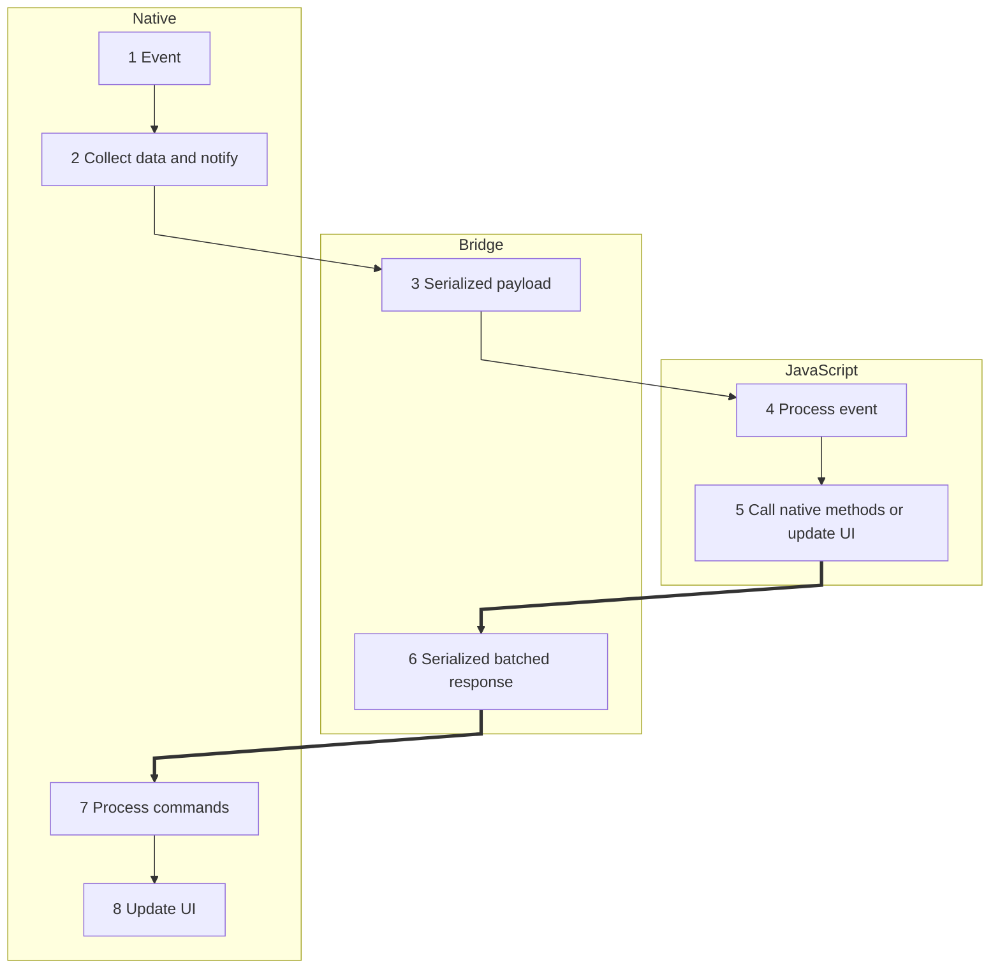

# React Native 앱의 동작 순서

- JavaScript 레이어(인터페이스, 영역)는 개발자가 작성한 코드

1. 사용자의 버튼 터치 등 이벤트 발생
2. nativeOS(android/iOS)에서 이를 감지하고 이벤트 정보 수집 및 전달 준비
3. 이벤트 데이터를 JSON 형태로 직렬화하여 bridge 를 통해 JS 로 메시지 전송
4. JS 에서 메시지를 받아 처리
   (eventListener 호출)
5. JS 에서 native 메서드 호출 또는 UI 업데이트 요청
6. JS 응답을 직렬화한 후 bridge 를 통해 native 로 메시지 전송
   (비동기적, batch 방식)
7. nativeOS에서 JS 로부터 전달받은 명령 처리
8. nativeOS에서 최종 UI 업데이트
