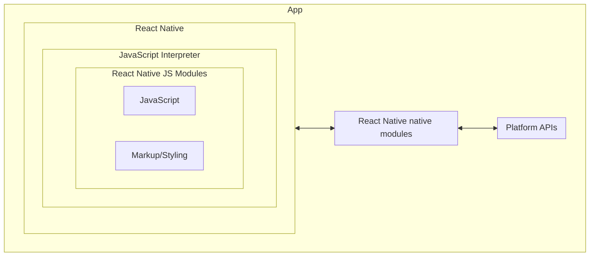
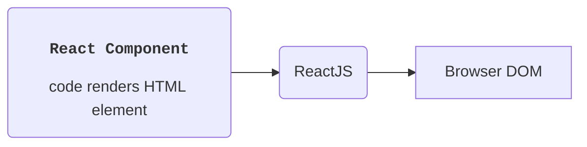
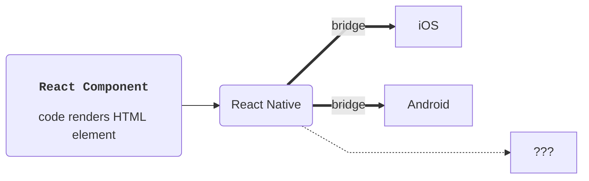

# React Native 앱 구조

- Bridge 들을 통해 코드가 운영체제와 통신할 수 있도록 하는 인프라
- 개발자가 작성한 JavaScript 코드가 운영체제와 통신할 수 있도록 함(like shell)
- android: Java + JavaScript,
  iOS: Objective-c, Swift + JavaScript
- 앱 compile 시...
  android: .apk,
  iOS: .ipa
- Java 와 Xcode 로 인프라를 가져와 apk 또는 ipa 안에 포함

---

- React Native JS 모듈과 운영체제 사이의 인터페이스 역할
- browser X, translator O
  iOS 또는 Java android 코드로 번역
  > 1. RN이 특정 요소 표시 요청(bridge)
  > 2. android / iOS 가 요소 표시  
  >    (OS가 그리므로 각자 다른 모습)
